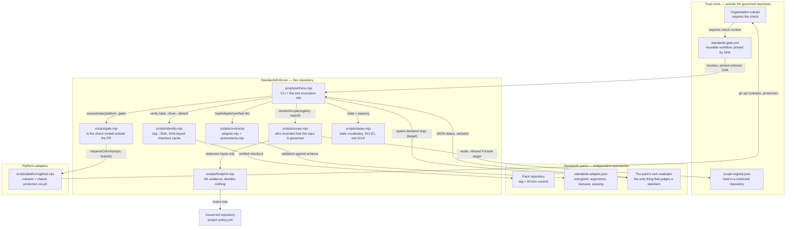
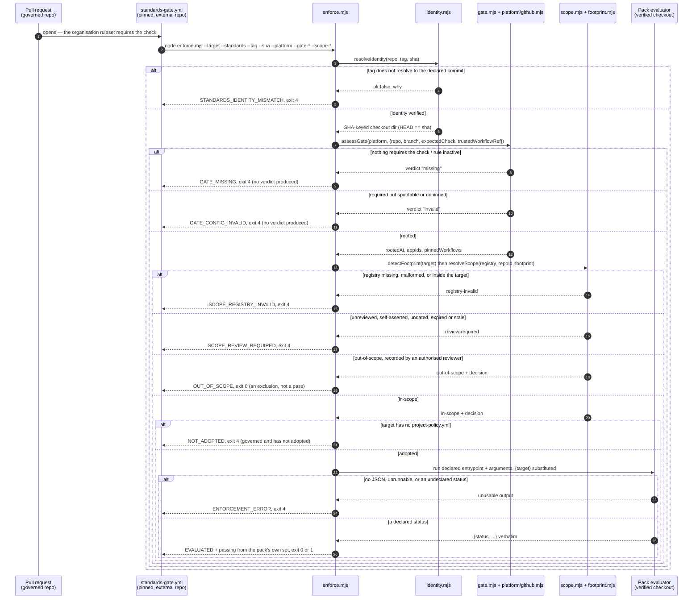

# Architecture — StandardsEnforcer

> StandardsEnforcer decides **which independent standards releases govern a repository**, pins each
> one by an immutable identity, executes that release's own evaluator, and refuses to let a required
> standard be silently absent or bypassed. It contains no standard: no rule, no detector, no
> applicability logic, no scoring. Its users are the people who operate a governed portfolio of
> repositories — the organisation ruleset that requires its check, the reviewers who record scope
> decisions in an external registry, and the pull requests that must pass through it. Everything it
> reports is about *enforcement* — whether an authority could be identified, reached, trusted and
> heard — never about what a standard means.

The one invariant that shapes every module:

> **INV-E1 — StandardsEnforcer must never convert an unknown, missing, unverifiable, or failed
> enforcement condition into a successful compliance result.**

---

## Tech Stack

| Layer | Technology |
|---|---|
| Language / runtime | JavaScript, ES modules (`.mjs`), Node **≥ 18** (`engines` in `package.json`); CI runs Node 20 |
| Dependencies | **None.** No `dependencies`, no `devDependencies`, no lockfile, no install step — deliberate: an install is a second thing that can differ between the machine that reviewed a release and the machine that runs it |
| Test runner | `node --test` (built-in), invoked as `npm test`; 12 test files, ~3,100 lines, 163 tests |
| Schema validation | `scripts/contracts/jsonschema.mjs` — a hand-written JSON Schema 2020-12 subset evaluator, adopted from StandardsOrchestrator, that **throws on any keyword it cannot enforce** |
| Platform access | The `gh` CLI, spawned as a subprocess (`scripts/platform/github.mjs`). No HTTP client, no stored credentials |
| Git access | The `git` CLI, spawned as a subprocess (`scripts/identity.mjs`) |
| Packaging | `package.json` `bin: { "standards-enforce": "scripts/enforce.mjs" }`, `private: true`, `UNLICENSED` |
| CI | GitHub Actions — `.github/workflows/ci.yml` (test on push/PR) |
| Distribution as a gate | `.github/workflows/standards-gate.yml` — a `workflow_call` reusable workflow, **intended to be hosted outside every governed repository** |

Version today: `VERSION` = `0.4.0`, `package.json` = `0.4.0` (a test asserts they agree),
`SCHEMA_VERSION` in `scripts/enforce.mjs` = `0.4.0` (independent lifecycle — see `CHANGELOG.md`).

---

## Runtime Processes

There is no server, no daemon, and no long-running service. The system has exactly two runtime
shapes, and one of them is a configuration artifact rather than code this repository executes.

### 1. `standards-enforce` — the CLI

**Host:** Any Node ≥ 18 runtime; in practice a GitHub Actions runner (`ubuntu-latest`).
**Entry point:** [`scripts/enforce.mjs`](../scripts/enforce.mjs) — the `main()` guard at the bottom
fires only when `process.argv[1]` ends with `enforce.mjs`, so the module is importable by tests
without executing.
**Purpose:** One run answers one question about one *(governed repository, standards release)* pair:
may a merge proceed, and on whose authority. It verifies the standards identity, assesses the
enforcement root, resolves scope, checks adoption, invokes the pack's declared evaluator exactly
once, and projects the outcome onto an exit code. It writes a human render to stdout by default and
the full result envelope under `--json`.

It also spawns two kinds of child process: `git` and `gh` (both via `spawnSync`), and the pack's own
evaluator (via `spawnSync(process.execPath, [entrypoint, ...argv])` — all eight known packs are Node,
and the contract has no `runtime` field precisely because nothing has yet forced one).

**Arguments accepted** (`parseArgs`, `scripts/enforce.mjs:341`):

| Argument | Meaning |
|---|---|
| `--target=<path>` | The governed repository. Also accepted as the first bare positional argument |
| `--standards=<path>` | The standards pack repository on disk |
| `--tag=<tag>` | The release tag being enforced. Required |
| `--sha=<40-hex>` | The commit that tag must resolve to. Required |
| `--cache=<path>` | Checkout cache root; defaults to `<tmpdir>/standards-enforcer-cache` |
| `--json` | Emit the result envelope instead of the human render |
| `--platform=<name>` | Gate platform; only `github` is registered |
| `--gate-repo=`, `--gate-branch=`, `--gate-check=` | The repository, branch and required check context to assess |
| `--trusted-workflow=<ref>` | The reusable-workflow ref that must be pinned to a commit |
| `--require-organisation-root` | Refuse a repository-level rule as the enforcement root |
| `--scope-registry=<path>`, `--repo-id=<id>`, `--standard=<id>`, `--repo-name=<name>` | The external registry, the immutable platform identity to look up, and which standards pack is asking. All but `--repo-name` are required together — a half-configured scope check is not a scope check |

Both the gate group and the scope group are **all-or-nothing**: supplying any option from a group
without its required companions is an argument error, not a half-check. "A half-configured gate is
not a gate," and half of a control reads like the whole of one in a log.

### 2. `Standards gate` — the reusable GitHub Actions workflow

**Host:** GitHub Actions, `workflow_call`.
**Entry point:** [`.github/workflows/standards-gate.yml`](../.github/workflows/standards-gate.yml)
**Purpose:** This is the deployment shape of the whole system. It is **not meant to live in a
governed repository** — it is hosted in a repository governed projects cannot write to, the
organisation ruleset requires the check it produces, and a governed project references it pinned to a
40-hex commit SHA. It checks out four trees side by side (`target/`, `standards/`, `enforcer/`,
`scope/` — the registry deliberately *beside* the target, never inside it), installs Node 20, and
runs `enforce.mjs` with the gate and scope arguments wired from GitHub context.

Three properties make it a root of trust, and the enforcer checks all three rather than assuming
them: the **organisation** requires the check; the requirement is **bound to an app**; and this
workflow is **pinned**. It requests `contents: read` and `administration: read` — the latter so the
enforcer can read the ruleset that requires it, which is the only way a removed requirement becomes
visible from inside the run it was supposed to require.

### 3. `standards-enforcer CI` — this repository's own test workflow

**Host:** GitHub Actions, `ubuntu-latest`.
**Entry point:** [`.github/workflows/ci.yml`](../.github/workflows/ci.yml)
**Purpose:** Runs `npm test` on push to `main` and on every pull request. There is no install step,
for the same reason the runtime has no dependencies.

---

## Background Jobs

**There are none.** No scheduled tasks, no cron, no workers, no queues, no pollers, no
`IHostedService` equivalent. Every execution is a synchronous, single-shot CLI invocation driven by a
pull request or a human at a terminal. `scripts/footprint.mjs` has its own `main` guard and can be
run standalone (`node scripts/footprint.mjs <dir>`) to produce the evidence basis a reviewer pastes
into a registry entry — that is a reporting command, not a job, and it always exits `0` because
reporting is not a verdict.

---

## API Endpoints

**There are none.** This system exposes no HTTP surface. It is a CLI and a workflow.

Its *consumed* HTTP surface, reached indirectly through the `gh` CLI, is documented under
[External Integrations](#external-integrations).

The nearest thing to a public API is the **result envelope** written by `--json`, which the
`CHANGELOG` names as part of the public contract alongside the state vocabulary, the exit codes and
the accepted CLI arguments:

```jsonc
{
  "schemaVersion": "0.4.0",
  "state": "EVALUATED",              // one of scripts/states.mjs STATE
  "passing": false,                  // whether a merge may proceed
  "isStandardsVerdict": true,        // state === EVALUATED
  "detail": "the authority reported \"NOT_EVALUATED\", which its own contract does not declare passing",
  "standards": { "repo": "...", "tag": "v1.4.0", "sha": "...", "verified": true,
                 "materialisedAt": "...", "fromCache": false },
  "gate":   { "checked": true, "rooted": true, "rootedAt": ["organization"], "appIds": [...], "note": "..." },
  "scope":  { "checked": true, "disposition": "in-scope", "detection": {...}, "decision": {...}, "standsOn": "..." },
  "standardsExitCode": 3,            // the pack's own process status, recorded, never interpreted
  "authority": { "standard": "machine-learning", "status": "NOT_EVALUATED" },
  "report":  { /* the pack's own JSON, verbatim */ },
  "authoritative": true              // true only when gate.rooted === true
}
```

---

## Database

**There is none.** No SQL, no ORM, no migrations, no embedded store.

Two pieces of durable state exist on disk, and neither is a database:

| Store | Location | Purpose | Written by |
|---|---|---|---|
| **Checkout cache** | `<cacheRoot>/<40-hex-sha>/`, default `<tmpdir>/standards-enforcer-cache` | A materialised standards tree, content-addressed by commit. A sibling `<sha>.complete` marker distinguishes a finished entry from a truncated one — *beside* the entry, never inside it, so the tree stays byte-identical to the commit. **The marker is not evidence of identity:** every hit is re-verified against the commit before use, and an entry that fails is discarded and rebuilt (FE-13) | `materialise()` in `scripts/identity.mjs` |
| **Scope registry** | A JSON file in a *different* repository — path supplied by `--scope-registry` | The governed population's scope dispositions, keyed by immutable platform identity. **Never inside the repository it governs**; `loadRegistry()` refuses that outright | Humans and their tooling, outside this repository. The enforcer only reads it |

The registry's shape is documented by example in
[`artifacts/scope-registry.example.json`](../artifacts/scope-registry.example.json):

| Field | Meaning |
|---|---|
| `schemaVersion` | `"1.0.0"` |
| `authorisedReviewers[]` | The trust source. An empty or missing list makes **every** entry non-authoritative, and the registry is refused |
| `repositories["github:<numeric id>"]` | Keyed by immutable identity. `name` is for humans and is never matched on |
| `…​.standards["<pack id>"].disposition` | `in-scope` or `out-of-scope`. Anything else is review-required. **Keyed by the asking pack's own contract id** — the unit is repository × standards pack, and no pack is privileged in code |
| `…​.reviewedBy` / `reviewedAt` / `reason` | Required for both directions. Missing any of them makes the entry a proposal, not a decision |
| `…​.reviewedFootprint.{surface,kinds,digest}` | The evidence basis, naming the surface it was reviewed against. Without it a decision cannot go stale, and is therefore not trusted to be fresh. A basis naming a surface this run did not observe is **undetermined** — neither fresh nor stale — and goes back to a human |
| `…​.revisitWhen[]`, `evidence[]`, `expiresAt` | Reviewer-supplied context; `expiresAt` is an optional self-imposed bound, not a default timer |

---

## External Integrations

| System | Purpose | How connected |
|---|---|---|
| **git** (local) | Resolve a tag to a commit, clone the standards repository into the SHA-keyed cache, detach onto the commit, confirm `HEAD` | `spawnSync("git", …)` in `scripts/identity.mjs`. The source repository is **never mutated** — no `git worktree`, no in-place checkout |
| **GitHub REST API — rulesets** | `GET repos/{repo}/rules/branches/{branch}` — the required status checks and required-workflow rules that actually apply to a branch, including organisation-inherited ones. This endpoint returns only actively enforced rules, so a ruleset in evaluate mode correctly does not appear | `gh api …` in `scripts/platform/github.mjs` |
| **GitHub REST API — classic branch protection** | `GET repos/{repo}/branches/{branch}/protection` — still widely in use. A 404 here means "no classic protection", which is a real answer rather than a failure | `gh api …` in `scripts/platform/github.mjs` |
| **The `gh` CLI itself** | Authentication is the operator's existing `gh` login. This repository stores no credentials. Where `gh` is absent or unauthenticated the adapter says so and the caller treats it as an **unknown**, never as an absence | subprocess |
| **Standards packs** | Each pinned release's own evaluator, invoked exactly as its `standards-adapter.json` declares | `spawnSync(process.execPath, [entrypoint, ...argv])` from `scripts/enforce.mjs` |
| **Scope registry repository** | Read-only. Checked out beside the target by the gate workflow | filesystem read |

**Both GitHub sources must answer.** If rulesets fail while classic protection returns an empty list,
that looks exactly like "nothing is required" — and reporting an unknown as an absence is the failure
this family of repositories exists to prevent. `githubPlatform().requiredChecks()` fails the whole
call if either source errors.

---

## Layers & Components

### Orchestration — `scripts/enforce.mjs` (457 lines)

**Responsibility:** The CLI, the enforcement sequence, and **the only place a standards system is
invoked**.

- `enforce({target, standardsRepo, tag, sha, cacheRoot, gate, platform, scope, today})` — the whole
  sequence. The order is deliberate: **identity → enforcement root → scope → adoption → official
  evaluation → pass-through**, and every step before the last can only produce a non-passing state.
  Identity is first because running an unverified implementation and *then* discovering it was the
  wrong one means a verdict already exists — and a verdict that exists gets quoted.
- `result(state, detail, extra, passing)` — the single construction point for every result. It is
  where `REQUIRES_RECORDED_DECISION` is enforced, so no future branch can reach the passing set
  through an absence; a state in that set produced without `reviewedBy`/`reviewedAt`/`reason` is
  demoted to `SCOPE_REVIEW_REQUIRED`. It also stamps `authoritative: gate.rooted === true`. Scope
  authority is deliberately **not** folded into `authoritative`.
- `loadAdapter(standardsDir)` — reads `standards-adapter.json` from the verified checkout. **The
  signature is the point:** it takes the directory and derives the path itself, so there is no
  parameter a caller could use to substitute another location (ADR 0005). It then performs the
  *resolved* containment check — that the entrypoint, once joined and fully resolved, is still inside
  the checkout — which a static check cannot do because it cannot know about a symlink.
- `runOfficialEvaluator(standardsDir, target)` — runs the declared argv **once**, with `{target}`
  substituted. **No probing and no fallback:** it does not try `validate` because `evaluate` failed,
  because `check` exists in two packs and answers a different question in both.
- `describe(status, passing)` — one line of context beside the verdict, reading only the status and
  the pack's own passing set. It used to print the project, score and pass/fail counts;
  MathematicsStandards reporting `score: 97` with 52 rules passed *beside a status of
  `NOT_EVALUATED`* is why it no longer does.
- `render(r)` / `parseArgs(argv)` / `main()` — human output, argument parsing, process exit.

`POLICY_FILE = "project-policy.yml"` — its presence in the target is adoption. Its absence is
`NOT_ADOPTED`, which is **not** non-compliance, and which reads more strongly when scope confirmed
the repository is governed.

### The state vocabulary — `scripts/states.mjs` (146 lines)

**Responsibility:** What the enforcer is allowed to say, and what a process exit means.

| Export | What it is |
|---|---|
| `STATE` | The frozen state surface. Changing it is a breaking change |
| `PASSING` | The **closed** set of enforcement states a merge may proceed on without an authority speaking. Today exactly `{ OUT_OF_SCOPE }`. Written as a set rather than a default, because a default is how an unlisted state becomes a pass |
| `REQUIRES_RECORDED_DECISION` | `{ OUT_OF_SCOPE }` — passing states that must carry a named reviewer, a date and a reason |
| `EXIT` | `{ OK: 0, NOT_PASSING: 1, NOT_ENFORCEABLE: 4 }` |
| `exitFor(state, passing = false)` | The projection. Takes `passing` rather than deriving it, because deriving it would mean recognising a status. A caller that forgets gets `false`, which fails closed |
| `REACHABLE` | The states the implementation can actually produce. The gap between `STATE` and `REACHABLE` is recorded as data with a test asserting it, rather than as a comment nobody checks |

The full state table:

| State | Meaning | Exit |
|---|---|---|
| `EVALUATED` | An authority was identified, invoked, and returned a status it had declared. Says nothing about *what* was said — that rides beside it in `passing` | `0` or `1` |
| `NOT_ADOPTED` | No standards version governs this repository (or: it is governed and has not adopted) | `4` |
| `SCOPE_REVIEW_REQUIRED` | The scope disposition is absent, unauthorised, undated, unreasoned, expired, basis-less, or stale | `4` |
| `OUT_OF_SCOPE` | An authorised reviewer recorded that these standards do not govern this repository | `0` |
| `SCOPE_REGISTRY_INVALID` | The registry is missing, malformed, or inside the repository it governs | `4` |
| `GATE_MISSING` | Nothing requires the standards check on the governed branch | `4` |
| `GATE_CONFIG_INVALID` | Something requires it, in a way the pull request could satisfy for itself | `4` |
| `BYPASS_USED` | An authorised bypass was used; an event, never a verdict. **Not reachable** — see Known Constraints | `4` |
| `STANDARDS_IDENTITY_MISMATCH` | The declared release does not resolve to the declared commit | `4` |
| `ENFORCEMENT_ERROR` | Enforcement could not be carried out | `4` |

**`4` is reserved exclusively for the enforcer's own inability to establish enforcement.** It is a
code MachineLearningStandards never returns, so a caller can tell *the standards said no* from
*enforcement could not be established*. `1` reads as "an authoritative evaluation completed and did
not establish passing" — deliberately **not** as "non-compliant"; a pack's `NOT_EVALUATED` lands
there without this enforcer calling it a failure.

### Identity — `scripts/identity.mjs` (135 lines)

**Responsibility:** Establishing *which implementation actually ran*.

An identity is a triple — repository, release tag, 40-character commit SHA — and all three must
resolve consistently before anything executes.

- `verifyTagResolvesTo(repo, tag, sha)` — rejects an abbreviated SHA outright ("an abbreviation is not
  an identity"). Uses `git rev-list -n 1 <tag>`, which dereferences an annotated tag to the commit it
  points at; `rev-parse <tag>` would return the tag *object's* SHA. On mismatch it runs
  `git rev-parse <tag>` specifically to diagnose the common mistake — the declared SHA being the
  annotated tag object rather than the commit — and names it, because every tagged pack in the C0
  inventory was recorded that way.
- `checkoutIsExactly(dir, sha)` — is this directory, right now, that commit? Three questions in the
  order that keeps their answers distinguishable: is there a repository here, is `HEAD` the commit,
  and does `git status --porcelain` come back empty. The third is not decoration — an edited file
  leaves `HEAD` untouched and changes what executes.
- `materialise(repo, sha, cacheRoot)` — `git clone --no-checkout --no-hardlinks` into a per-process
  staging directory, then `git checkout --detach <sha>`, then `checkoutIsExactly`, then rename into
  `<cacheRoot>/<sha>`. Detaching onto the SHA rather than the tag means a tag moved between
  verification and execution cannot change what executes. The `<sha>.complete` marker is written
  last; without it the entry is rebuilt. **A cache hit is re-verified by the same check before it is
  returned** — an entry that fails is discarded and rebuilt, and the reason travels back as
  `repaired` rather than vanishing. Staging plus rename is what keeps repair from deleting a tree a
  concurrent run is executing from.
- `resolveIdentity({repo, tag, sha, cacheRoot})` — the composition. Two outcomes only, and in
  particular no "close enough". The filesystem calls are wrapped so a fault is reported as a reason
  rather than thrown, because an exception would be a third outcome.

The third check — that the *materialised* checkout is the SHA — is not redundant with the first. One
asks what the tag points at; the other establishes what is about to run. It runs on **every**
execution, including cached ones: it used to run once, at population time, after which a marker file
stood in for it, which made the marker an artifact asserting the right thing rather than evidence
that the thing was true. Caching may avoid reacquisition; it may never substitute for verification.

### The enforcement root — `scripts/gate.mjs` (191 lines)

**Responsibility:** Is this repository's standards check required from somewhere the governed pull
request cannot reach? Platform-agnostic — everything here is semantics, so the Azure DevOps adapter
later changes none of it.

- `isPinnedWorkflowRef(ref)` — a reusable-workflow reference is pinned only when it names a 40-hex
  commit.
- `assessGate(platform, {repo, branch, expectedCheck, trustedWorkflowRef, requireOrganisationRoot})`
  — returns `{verdict: "rooted" | "missing" | "invalid", why, detail}`.
- `GITHUB_ACTIONS_APP_ID = 15368` — and the reason it is named here is a **negative** finding.

The four semantics it encodes, each a way the obvious implementation goes wrong:

1. **A gate is a required check, not a workflow file.** `.github/workflows/standards.yml` existing
   establishes nothing; the file is inside the PR's own tree, so treating its presence as the gate
   would make the gate deletable by the thing it gates.
2. **A required check matched by name alone is spoofable.** GitHub matches by context string, so a
   PR can add a workflow emitting a check of the same name and pass it. The requirement must be bound
   to an app (`integration_id` on a ruleset, `app_id` on classic protection).
3. **The trusted implementation must itself be pinned.** `@main` moves the mutable-root problem one
   repository outward.
4. **A bypass is an event, not a verdict.** An authorised administrative bypass does not retroactively
   make a failed evaluation pass.

And the M4 finding that supersedes (2) on GitHub: **binding to the GitHub Actions app is not a
root.** Every workflow in a repository runs as that app, including one a pull request adds, so a
requirement bound to it is satisfied by the PR's own green tick. The only thing that rescues an
Actions-produced check is a `workflows` ruleset rule naming a repository, a path and a commit the
pull request does not control. Verified live: `mergeable: MERGEABLE, mergeStateStatus: CLEAN` on a PR
that had deleted the enforcement and replaced it with `run: echo`.

Two further checks: a rule in **evaluate/dry-run mode** reports as configured and blocks nothing, so
it is `missing`; and a platform that cannot answer is `invalid`, never `missing` — INV-E1 forbids
resolving an unknown in the permissive direction.

### Scope — `scripts/scope.mjs` (223 lines)

**Responsibility:** Has an authorised human decided that a standards release governs this repository?

- `DISPOSITION` — `{ IN_SCOPE: "in-scope", OUT_OF_SCOPE: "out-of-scope" }`, the two values a registry
  entry may carry.
- `OUTCOME` — `{ IN_SCOPE, OUT_OF_SCOPE, REVIEW_REQUIRED, REGISTRY_INVALID }`.
- `loadRegistry(registryPath, {target})` — structural validation, JSON rather than YAML because this
  repository will not gain a dependency to read a governance artefact. Refuses a registry located
  inside the governed tree; refuses one with no `authorisedReviewers`.
- `resolveScope({registryPath, repoId, repoName, target, footprint, today})` — the lookup and every
  way it can fail to produce a disposition.

Four load-bearing properties:

1. **The target cannot own its own scope.** A `scope: out-of-scope` key in the governed repository is
   a request, not a decision — the exact parallel to M2's "a gate is not a file in the repository it
   gates".
2. **An exclusion is a record, not an absence.** `OUT_OF_SCOPE` requires a named authorised reviewer,
   a date, a reason and an evidence basis.
3. **Staleness is a change in evidence, not the passage of time.** What invalidates a decision is the
   repository acquiring or losing a *kind* of ML evidence relative to the reviewed footprint. An
   arbitrary 90-day expiry manufactures review churn without adding assurance — "a review that fires
   for no reason stops being a review."
4. **Detection never confirms.** Every fresh disposition carries a `standsOn` string saying in words
   that automated detection did not confirm the decision; it only failed to contradict it.

Lookup is by **immutable platform identity**, never by name. When an entry carries a matching `name`
under a different identity, that is reported explicitly as a `nameCollision` — it is what a rename, a
transfer, or a different repository squatting a freed name looks like from here.

Everything unresolved lands in one outcome, `REVIEW_REQUIRED`: unreviewed, self-asserted, undated,
unreasoned, expired, basis-less, and stale. All of them are questions for a human, and none of them
is a pass.

### Detection — `scripts/footprint.mjs` (255 lines)

**Responsibility:** *What ML-like evidence did automation observe in this tree?* — and nothing else.
It is structurally incapable of answering whether the standards govern the repository.

- `detectFootprint(root)` → `{kinds, signals, digest, filesScanned, assurance: "partial", note}`
- `footprintDigest(kinds)` — SHA-256 over the sorted **kinds**, truncated to 32 chars.
- `codeView(text)` — strips comments and string contents, so naming a library is never mistaken for
  using it. Approximate *in the safe direction*: a missed strip can only surface a repository for
  human review, whereas silently discarding real code would let detection go quiet.
- `SIGNAL_KINDS` — the seven kinds it can emit:

| Kind | What it means |
|---|---|
| `training-framework-import` | A training framework is imported by code in this repository |
| `training-framework-dependency` | A training framework is declared in a dependency manifest |
| `training-call-shape` | Code calls a training-shaped API **alongside** a framework import |
| `inference-client` | Code calls a hosted model API but trains nothing |
| `experiment-tracking` | Experiment tracking or sweep tooling is imported |
| `model-artifact` | A serialised model is committed (`.pt`, `.pkl`, `.onnx`, `.safetensors`, …) |
| `dataset-artifact` | Tabular or tensor data is committed (`.csv`, `.parquet`, `.npz`, `.dvc`, …) |

Two deliberate exclusions, each buying precision automation cannot otherwise have:
**numpy/pandas/scipy/matplotlib are absent** from the framework list — a repository doing statistics
is not a repository doing machine learning; and **inference clients are a separate kind** from
training frameworks — a repository that calls a hosted API trains and evaluates nothing.
`training-call-shape` fires only in a file that already imports a framework, because a bare `.fit(`
in scipy code is not training and a signal that fires on it teaches reviewers to ignore signals.

The digest covers **kinds, not file contents**, so ordinary commits to a repository whose ML
character has not changed do not manufacture review churn, while a repository that gains or loses a
whole kind of evidence does.

### The adapter contract — `scripts/contracts/` (378 lines across two files)

**Responsibility:** The protocol by which a pack declares how it is invoked and how its result is
read. **StandardsEnforcer owns the schema; packs own declarations conforming to it.**

`adapter.mjs`:

- `SCHEMA_PATH` — resolved from this module's own location, never from a caller-supplied path.
- `ADAPTER_FILENAME = "standards-adapter.json"` — named once so the enforcer and pack CI cannot
  disagree about it.
- `PLACEHOLDERS = ["{target}"]` — frozen. A placeholder outside this set is a hard violation rather
  than a value passed through literally, because `--policy={policy}` would reach a pack's CLI as
  eleven literal characters and a pack that treats an unreadable policy path as "no policy" would
  then answer confidently about the wrong thing.
- `validateAdapter(declaration)` — runs the schema, then adds the three things JSON Schema cannot
  express: entrypoint **containment** (segment-wise, because `../../../etc/passwd` matches the
  schema's pattern happily), **unknown placeholders**, and `passing ⊆ statuses`.
- `assertAdapterConforms` / `readAdapter(file)` — the throwing forms. A parse failure is reported as a
  contract violation rather than a `SyntaxError`, because to every caller "this file is not JSON" and
  "this JSON is not an adapter" are the same event.

Two callers, neither substituting for the other: **pack CI** asks *does the adapter I am about to
release conform?* (producer assurance, skippable); **enforcer load** asks *does the adapter I just
obtained from this verified release conform, before I trust it?* (consumer defence, runs every time).

`jsonschema.mjs` — a JSON Schema evaluator covering exactly the keywords the adapter schema uses
(`type`, `required`, `properties`, `additionalProperties`, `pattern`, `const`, `enum`, `minLength`,
`items`, `minItems`, `uniqueItems`, `contains`) and **refusing to run against anything else**. An
unsupported keyword throws rather than being ignored, because a validator that silently skips a
constraint reports conformance for a document it never fully checked. `$absentByDesign` — this
repository's own root annotation documenting fields no pack forced — is listed explicitly in
`ANNOTATIONS` rather than admitted by a `^\$` prefix rule, which would silently admit `$ref`.

### Platform adapters — `scripts/platform/github.mjs` (105 lines)

**Responsibility:** Everything platform-specific, behind one method.

`githubPlatform()` returns `{name, requiredChecks(repo, branch)}` yielding
`{ok, why, checks: [{context, appId, source, enforcement}], workflows: [{repositoryId, path, ref, sha, source}]}`.
Two sources are read and normalised to one shape — rulesets (organisation- or repository-scoped) and
classic branch protection — because a repository may be governed by either and an enforcer that knew
about only one would report a real gate as missing. Classic protection contributes **no** workflows,
so a repository on classic protection alone cannot root an Actions-produced check — a true statement
about GitHub, not a gap in this adapter.

The adapter does not decide whether a gate is adequate. That is `gate.mjs`.

### Tests — `test/` (12 files, ~3,134 lines, 163 tests)

**Responsibility:** Holding the boundaries that comments only assert.

| File | What it holds |
|---|---|
| `authority-boundary.test.mjs` | **The ADR 0001 guard.** Scans every executable source for pack-native vocabulary and scoring, and asserts the guard *bites* on a planted violation and does not bite on the enforcer's own vocabulary |
| `open-vocabulary.test.mjs` | INV-E1: every state outside `PASSING` exits non-zero; an unrecognised state is not a pass; no native status can reach exit 2 or 3 by any route; `REACHABLE` gaps are declared, not faked |
| `adapter-conformance.test.mjs` | The released declarations conform; the shipped schema is fully enforceable; every mutation is rejected and the baseline is not; violations accumulate |
| `adapter-provenance.test.mjs` | Nine adversarial cases: a forged adapter in the target, one in the target's parent, no fallback to `main`, no cross-tag influence, entrypoint escape, symlink escape, and identity failing before any adapter is read |
| `gate.test.mjs` | Every gate semantic against an injected platform — missing, inactive, unbound, Actions-bound, pinned-workflow rooting, organisation rooting, and a platform that cannot answer |
| `scope.test.mjs` | Detection decides nothing; a registry inside the governed tree is refused; identity vs name; staleness in both directions; every incomplete decision |
| `scope-seam-invariance.test.mjs` | Adversarial: nothing a repository writes about its own scope changes its disposition |
| `identity-tags.test.mjs`, `identity-provenance.test.mjs` | Annotated vs lightweight tags, the tag-object mistake, cache naming, and that a failed identity materialises nothing |
| `enforce.test.mjs` | The M1 oracle against MachineLearningStandards `v1.4.0`, adoption, advisory runs, and the in-scope-and-not-adopted finding |
| `release.test.mjs` | `VERSION` and `package.json` agree |

Tests that need MachineLearningStandards on disk are guarded by `skip: !MLS_AVAILABLE`, so the suite
runs green without it — 163 tests, 162 passing and 1 skipped on a machine without the pack.

### Governance artifacts — `artifacts/`

Not code, but load-bearing: `adr/` (five accepted decisions), `evidence/` (fourteen dated records of
what was actually run and what it produced, including `m4-raw/` — the raw GitHub API JSON from the
live-repository experiment), `backlog/` (24 items over four milestone lineages), and
`scope-registry.example.json`.

---

## Data Flow

A pull request opened against a governed repository, end to end:

1. The PR opens. An **organisation ruleset** requires a check context — say `Standards gate / enforce`
   — on the default branch. Nothing in the PR's tree can remove that requirement.
2. The governed repository's workflow calls
   `acme/standards-ci/.github/workflows/standards-gate.yml@<40-hex-sha>`. The reference is pinned, so
   whoever can push to that repository's default branch cannot silently change what runs.
3. `standards-gate.yml` checks out four trees — `target/`, `standards/` (at
   `inputs.standards-sha`), `enforcer/` (at `inputs.enforcer-sha`), and `scope/` — installs Node 20
   with no install step, and runs `node enforcer/scripts/enforce.mjs` with `--repo-id=github:${{
   github.repository_id }}` (the numeric id, **not** the name — a name can be renamed, transferred,
   or freed and claimed by somebody else).
4. `enforce()` calls `resolveIdentity()` (`scripts/identity.mjs:126`). `git rev-list -n 1 <tag>` must
   equal the declared SHA; a tree is cloned into `<cache>/<sha>` and detached onto the SHA; `HEAD` is
   re-read. Any failure → `STANDARDS_IDENTITY_MISMATCH`, exit `4`, **and no evaluator runs**.
5. `assessGate()` (`scripts/gate.mjs:68`) checks the trusted workflow ref is pinned *before the
   platform is even asked*, then calls `githubPlatform().requiredChecks(repo, branch)`, which reads
   both `repos/{repo}/rules/branches/{branch}` and
   `repos/{repo}/branches/{branch}/protection` via `gh`. Verdict `missing` → `GATE_MISSING`;
   `invalid` → `GATE_CONFIG_INVALID`. Either way, exit `4` and **no verdict is produced at all** —
   which is the whole point of M2.
6. `detectFootprint(target)` (`scripts/footprint.mjs:160`) walks the target and produces kinds,
   signals and a digest. It decides nothing.
7. `resolveScope()` (`scripts/scope.mjs`) loads the external registry — refusing one inside the
   target — looks up `github:<id>`, then the disposition filed under the asking pack's id, and checks
   the reviewer is authorised, the date is a date, a reason exists, any `expiresAt` has not passed,
   and the recorded `reviewedFootprint.digest` still equals the one observed for the surface the basis
   names. **The asking pack's id comes from `--standard`, not from the pinned release's adapter**, so
   that a reviewed exclusion survives a release whose contract is malformed, absent or unusable — the
   invariant `test/scope-seam-invariance.test.mjs` exists to hold. Failure → `SCOPE_REVIEW_REQUIRED` or `SCOPE_REGISTRY_INVALID`, exit `4`.
   `out-of-scope` → `OUT_OF_SCOPE`, exit `0`, rendered explicitly as *"Nothing was evaluated. This is
   an exclusion, not a pass."*
8. `existsSync(target/project-policy.yml)` decides adoption. Absent → `NOT_ADOPTED`, exit `4`, phrased
   more strongly when scope confirmed the repository is governed: *"it is governed and has not
   adopted."*
9. `runOfficialEvaluator()` (`scripts/enforce.mjs:102`) calls `loadAdapter()`, which reads
   `standards-adapter.json` **from the verified checkout only**, validates it against the schema plus
   the three cross-field checks, and confirms the resolved entrypoint is still inside the checkout.
   The declared argv runs **once**, `{target}` substituted.
10. The report's top-level `status` must be a member of *this release's own declared* `statuses`. If
    it is not, that is an unknown, and INV-E1 says an unknown is not a pass →
    `ENFORCEMENT_ERROR`, exit `4`.
11. `passing = contract.result.passing.includes(status)`. **That is the entirety of the enforcer's
    opinion about the verdict.** No score, no summary count, no denominator is consulted;
    `test/authority-boundary.test.mjs` is what keeps that true.
12. `result(STATE.EVALUATED, …, passing)` builds the envelope with the pack's report carried
    verbatim under `report` and its own answer under `authority.status`. `exitFor()` projects it to
    `0` or `1`. If the gate was never checked, `authoritative` is `false` and the render says so.

---

## Key Patterns & Conventions

- **The single construction point.** Every result flows through one `result()` function
  (`scripts/enforce.mjs:150`), which is where the recorded-decision requirement is enforced. A rule
  applied at the one place a thing is built cannot be forgotten at the twentieth place it is built.
- **Closed sets over defaults.** `PASSING`, `REQUIRES_RECORDED_DECISION`, `PLACEHOLDERS`, `SUPPORTED`
  keywords, a pack's declared `statuses` — all enumerated. A default is how an unlisted thing becomes
  a pass, so there are no permissive defaults anywhere in the passing path.
- **Fail closed, and say which failure it is.** `exitFor(state, passing = false)` defaults to not
  passing. `GATE_MISSING` and `GATE_CONFIG_INVALID` are distinct states because "nobody requires
  this" and "something requires it in a way a PR can satisfy for itself" need different fixes.
- **An unknown is never an absence.** A platform that cannot answer is `invalid`, not `missing`. Both
  GitHub sources must succeed. Detection finding nothing establishes nothing.
- **Injected platform, semantics in the middle.** `assessGate(platform, …)` takes the platform as a
  parameter, so every gate semantic is asserted against recorded shapes without a network and the
  second adapter changes none of them (`test/gate.test.mjs`).
- **Signatures that forbid rather than discourage.** `loadAdapter(standardsDir)` has no `adapterPath`
  parameter *by design* — "a mechanism for substituting another location is a mechanism that gets
  used" (ADR 0005).
- **No probing, no fallback, no discovery.** One declared invocation, run once. No trying another
  subcommand, no searching `main`, no central registry.
- **Verbatim pass-through.** The pack's JSON is carried unmodified under `report`; the enforcer adds
  context beside it and never inside it, because a summary is a second definition.
- **The schema is executed, not described.** `jsonschema.mjs` runs the shipped schema and throws on
  any keyword it cannot enforce, so the schema and the validator cannot drift.
- **Zero dependencies, no install step.** Stated in the CI workflow itself: "an install is a second
  thing that can differ between the machine that reviewed a release and the machine that runs it."
- **Comments carry the *why*, at length.** Nearly every module opens with a multi-paragraph header
  explaining what went wrong somewhere else that forced this design. Treat those headers as part of
  the specification; several encode findings (the M4 Actions-app result, the MathematicsStandards
  `score: 97` case, the annotated-tag mistake) that are not recoverable from the code alone.
- **Prohibitions are held by tests, not intentions.** ADR 0001's boundary is
  `test/authority-boundary.test.mjs`, which also asserts that the guard bites.

---

## Diagrams

Canonical source: [`docs/architecture.mmd`](architecture.mmd) and
[`docs/architecture-sequence.mmd`](architecture-sequence.mmd). The blocks below are byte-identical to
those files, and [`architecture.svg`](architecture.svg) / [`architecture-sequence.svg`](architecture-sequence.svg)
are generated artifacts — regenerate them, never hand-edit them:

```bash
npx -y @mermaid-js/mermaid-cli -i docs/architecture.mmd -o docs/architecture.svg
```

### Component and trust topology



### The enforcement sequence, including every failure path



---

## Build, Test and Deployment

| Task | Command |
|---|---|
| Install | **Nothing to install.** Zero dependencies by design |
| Test | `npm test` (→ `node --test`) |
| Run the enforcer | `node scripts/enforce.mjs --target=<repo> --standards=<pack-repo> --tag=<tag> --sha=<40-hex> [--json]` |
| Get a scope evidence basis | `node scripts/footprint.mjs <dir>` |
| CI | `.github/workflows/ci.yml` on push to `main` and every PR |

**Deployment shape.** There is nothing to deploy in the usual sense. The system is "deployed" by
configuration, in three places that must all be outside the governed repositories:

1. `.github/workflows/standards-gate.yml` is hosted in a repository governed projects cannot write to.
2. An **organisation ruleset** requires the check that workflow produces, bound to an app the
   governed pull request cannot act as, or pinned by a `workflows` ruleset rule.
3. The **scope registry** lives in a third restricted repository, read by the workflow and checked out
   *beside* the target.

A governed repository then adds a one-job workflow calling the gate workflow pinned to a 40-hex SHA,
and a `project-policy.yml`. It can delete its own copy of that call; the requirement remains, the
check never reports, and the merge stays blocked — which is the intended behaviour and is asserted in
`test/gate.test.mjs`.

**Versioning while below 1.0.0** (from `CHANGELOG.md`): the minor position carries breaking changes.
The public contract is the state vocabulary, the exit codes, the result envelope, and the CLI's
accepted arguments. `VERSION` and `package.json` name one thing and a test asserts they agree;
`SCHEMA_VERSION` has an independent lifecycle and must not be synchronised by habit.

---

## Known Constraints and Gaps

Recorded here because the README states them plainly and an architecture document that quietly
dropped them would overstate the system's reach.

| Gap | Detail |
|---|---|
| **No live GitHub organisation** | The adapter's `integration_id`/`app_id` semantics come from documented responses and have never been exercised against a real *organisation* ruleset. M4 did exercise a live repository and produced the Actions-app finding, but this remains the weakest link and is the prerequisite for calling the system production-ready |
| **No repository discovery** | The registry answers what was decided about a repository it is *asked* about. Enumerating an organisation and noticing one never assessed at all is a different problem and is not built |
| **`BYPASS_USED` is unreachable** | And is now the only such state. GitHub exposes bypass events only through audit-log endpoints this enforcer cannot assume. The semantic is settled in ADR 0003; the state is not produced until the data can be read, and `REACHABLE` records the gap with a test asserting it |
| **No reviewer identity beyond a configured list** | `authorisedReviewers` is the narrow trust source scope needs. Real human-attestation identity — review provenance, CODEOWNERS, approvals — is a separate claim deserving its own adversarial tests |
| **One platform** | GitHub only. The seam exists (`assessGate` takes an injected platform), and every gate semantic is asserted against it, but no second adapter has been written |
| **One standard at a time** | No multi-standard composition. One run enforces one *(pack, release)* identity |
| **Detection is partial and one-directional** | Unrecognised frameworks, vendored code and generated pipelines are invisible to `footprint.mjs`. This is stated in the payload's `assurance`/`note`, not only in a comment |
| **No YAML parser** | `project-policy.yml`'s *presence* is adoption; its contents are never read here. The scope registry is JSON specifically to avoid a dependency |

Areas where the code left a question open rather than a gap:

- `scripts/enforce.mjs` imports `readFile` from `node:fs/promises` and defines `HERE`, neither of
  which is used in the current file. Harmless, but they are leftovers rather than intent.
- `enforce()` is `async` and awaited, but every step within it is synchronous (`spawnSync`,
  `existsSync`). The asynchrony is a signature choice, not a concurrency model.

---

## Entry Points for Common Tasks

| Task | Where to start |
|---|---|
| Add or change an enforcement **state** | `scripts/states.mjs` — add to `STATE`, decide `PASSING`/`REQUIRES_RECORDED_DECISION`/`REACHABLE` membership, then `test/open-vocabulary.test.mjs`. This is a **breaking** change; see `CHANGELOG.md` |
| Add a **CLI argument** | `parseArgs()` in `scripts/enforce.mjs:341`, and the all-or-nothing group validation just below it. The accepted arguments are public contract |
| Add a **platform adapter** (e.g. Azure DevOps) | `scripts/platform/` — implement `requiredChecks(repo, branch)` returning the normalised `{context, appId, source, enforcement}` shape plus `workflows`, register it in `PLATFORMS` at `scripts/enforce.mjs:48`. Change **no** semantics in `gate.mjs` |
| Change a **gate semantic** | `scripts/gate.mjs` — then `test/gate.test.mjs`, which drives every case through an injected platform |
| Change what the **adapter contract** allows | `schemas/standards-adapter.schema.json` first (it is the definition), then the cross-field checks in `scripts/contracts/adapter.mjs`. A new placeholder or field is a `schemaVersion` change. If you add a JSON Schema keyword, `scripts/contracts/jsonschema.mjs` will throw until it is implemented |
| Add an **ML detection signal** | `scripts/footprint.mjs` — add to `SIGNAL_KINDS` and the relevant constant list. Note this **changes every digest** for repositories that acquire the new kind, which correctly makes their scope decisions stale |
| Change **scope resolution** | `scripts/scope.mjs`, then `test/scope.test.mjs` and `test/scope-seam-invariance.test.mjs` |
| Change the **identity model** | `scripts/identity.mjs`, then `test/identity-tags.test.mjs` and `test/identity-provenance.test.mjs` |
| Change the **deployment/gate wiring** | `.github/workflows/standards-gate.yml` — and read its header comment first; the file documents why each property is a root of trust |
| Record a **decision** | `artifacts/adr/` — next number is `0006`. Note the numbering collision explained in ADR 0005 |
| Record **what was run** | `artifacts/evidence/YYYY-MM-DD-<slug>.md`, with raw tool output under a sibling directory where it matters (see `m4-raw/`) |
| Add or update **backlog work** | `artifacts/backlog/items/<ID>.md` and `artifacts/backlog/README.md` |
| Ship a **release** | Update `VERSION` and `package.json` together (a test asserts it), write the `CHANGELOG` entry with a migration table, and decide `SCHEMA_VERSION` separately |
